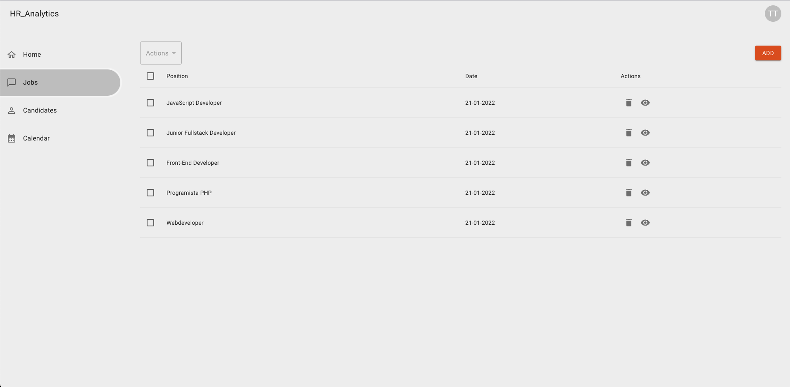
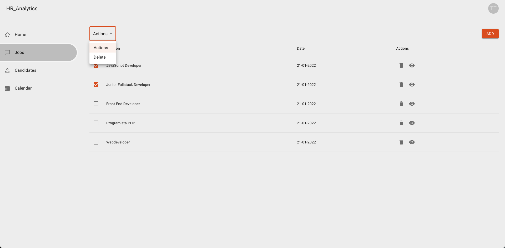

## Actions for multiple jobs
Stwórz branch na bazie gałęzi main:
`git checkout -b feature/actions-for-multiple-jobs main`

## Subtaski
- Nad tabelką z ofertami pracy wyświetl select z 2 opcjami: `Actions` które nic nie robi oraz `Delete`, które po wybraniu usuwa zaznaczone w tabelce oferty pracy
- Select jest `disabled` do momentu zaznaczenia co najmniej 1 oferty pracy
- Do usuwania użyj endpointu z poprzedniego zadania
- W przypadku kilku zaznaczonych ofert pracy powinieneś wysłać kilka requestów na raz
- Usunięcie przywraca od razu wartość selecta do `Actions`, w związku z tym po wykonaniu tej akcji użytkownik widzi z powrotem select z wartością `Actions`
- Usunięcie sprawia, że znikają zaznaczone oferty pracy w związku z czym select staje się disabled ponieważ w tabelce nie ma zaznaczonych ofert pracy (zaznaczone zostają usunięte)

## Nice to have
- Obsłuż błąd z api

## Szacunkowa estymacja: 4h

## Przykłady:

