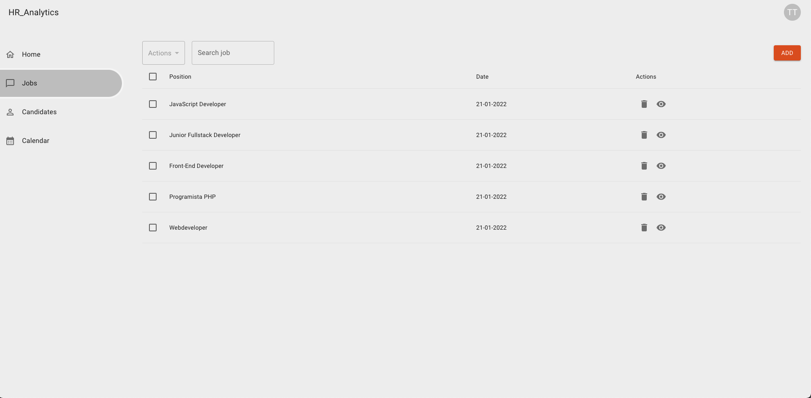
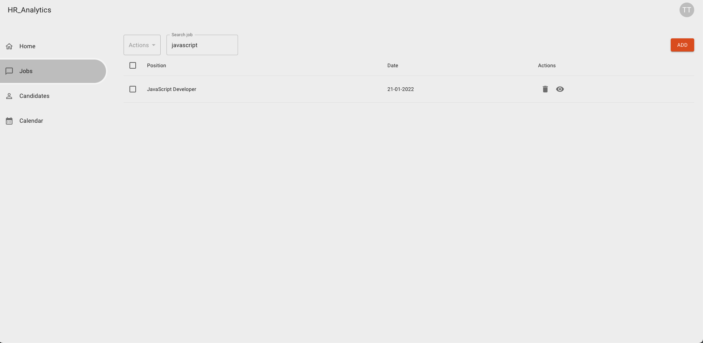
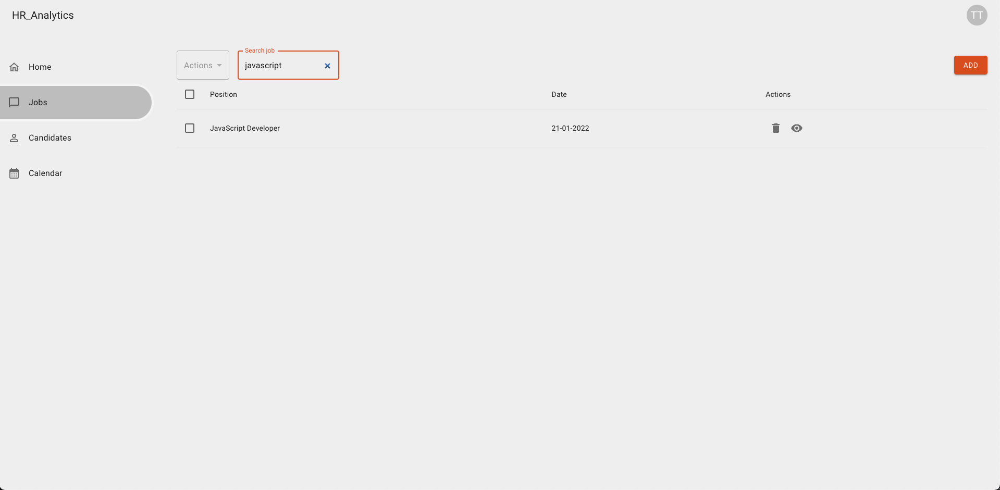

## Filter jobs
Stwórz branch na bazie gałęzi main:
`git checkout -b feature/filter-jobs main`

## Subtaski
- Nad tabelką z ofertami pracy wyświetl input
- Po zmianie wartości inputa przefiltruj dane w tabelce porównując nazwę oferty pracy z wpisaną wartością
- Filtrowanie powinno się odbywać dopiero po wpisaniu 3 znaków
- Jeżeli input ma wartość oraz focus to wyświetla ikonkę `x` która jest buttonem, który po kliknięciu usuwa wartość inputa
- Input po sfocusowaniu otrzymuje kolorowy border

## Nice to have:
- Debounce na filtrowanie, czyli opóźnienie wykonania logiki filtrowania dzięki czemu logika nie wykonuje się przy spamowaniu zmiany wartości inputa tylko uruchamia się raz na jakiś czas, najlepiej po zakończeniu wpisywania po 300 ms.

## Szacunkowa estymacja: 6h

## Przykłady:

