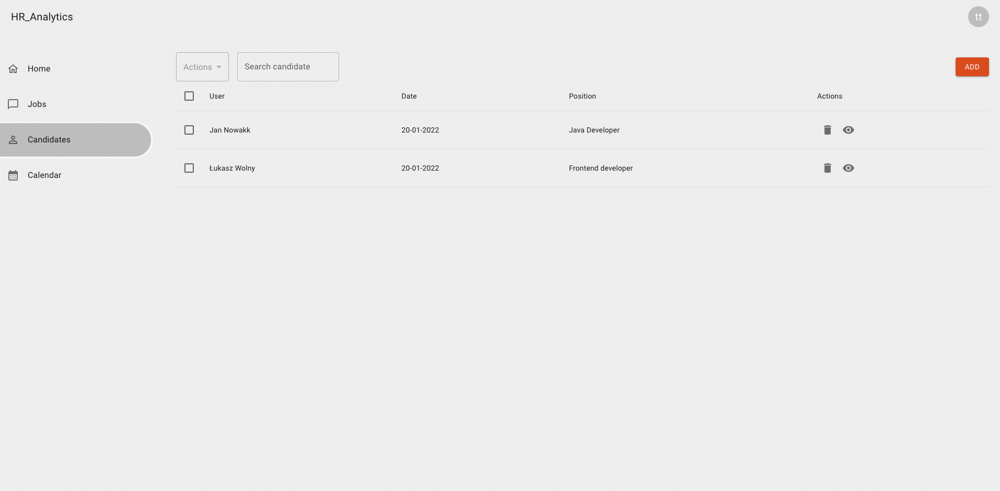
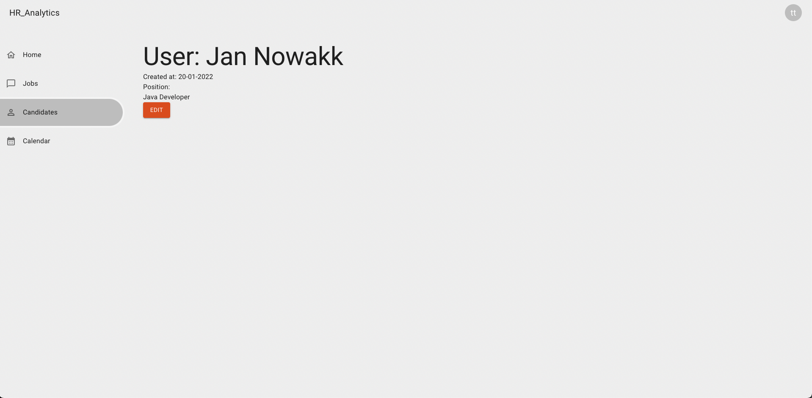
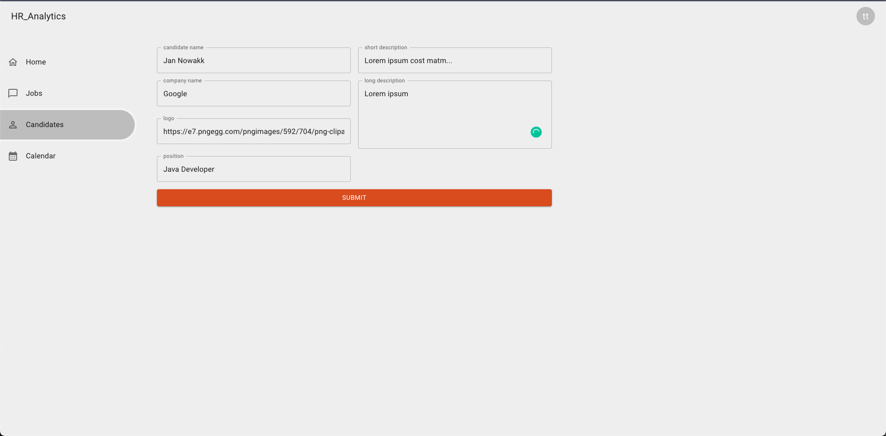

## Candidates
Stwórz branch na bazie gałęzi main:
`git checkout -b feature/candidates main`

## Subtaski
- Wszystko analogicznie jak w przypadku ofert pracy
- Routy: 
  - `/candidates`, tytuł strony `HR Dashboard - candidates`
  - `/candidates/:id`, tytuł strony `HR Dashboard - <candidate name>`, np.: `HR Dashboard - John Doe`
  - `/candidates/add`, tytuł strony `HR Dashboard - Add Candidate`
  - `/candidates/:id/edit`, tytuł strony `HR Dashboard - Edit Candidate`
- filtrowanie filtruje po imieniu i nazwisku kandydata
- `GET /candidates` w celu pobrania listy kandydatów
- `GET /candidates/:id` w celu pobrania pojedynczego kandydata
- `POST /candidates` w celu dodania nowego kandydata
- `PATCH /candidates/:id` w celu zaktualizowania danych kandydata
- `DELETE /candidates/:id` w celu usunięcia kandydata

## Nice to have:
- Debounce na filtrowanie, czyli opóźnienie wykonania logiki filtrowania dzięki czemu logika nie wykonuje się przy spamowaniu zmiany wartości inputa tylko uruchamia się raz na jakiś czas, najlepiej po zakończeniu wpisywania po 300 ms.
- Obsłuż błąd z api

## Szacunkowa estymacja: 8h

## Przykłady:

