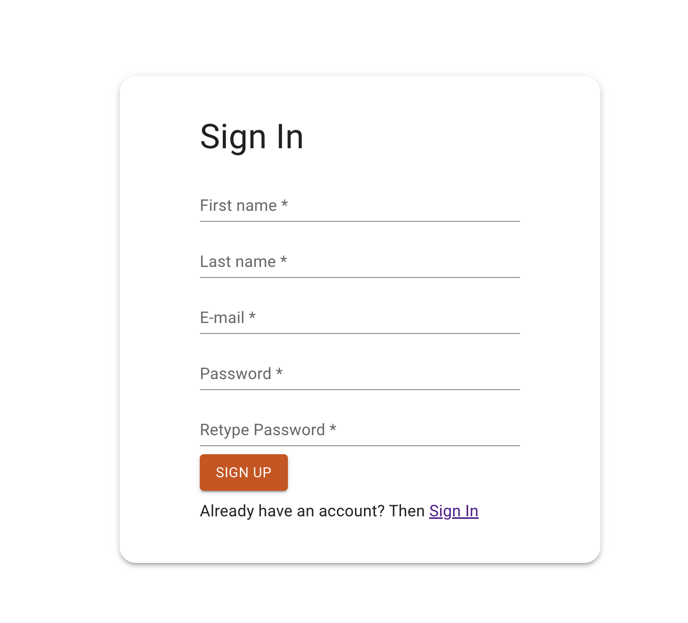
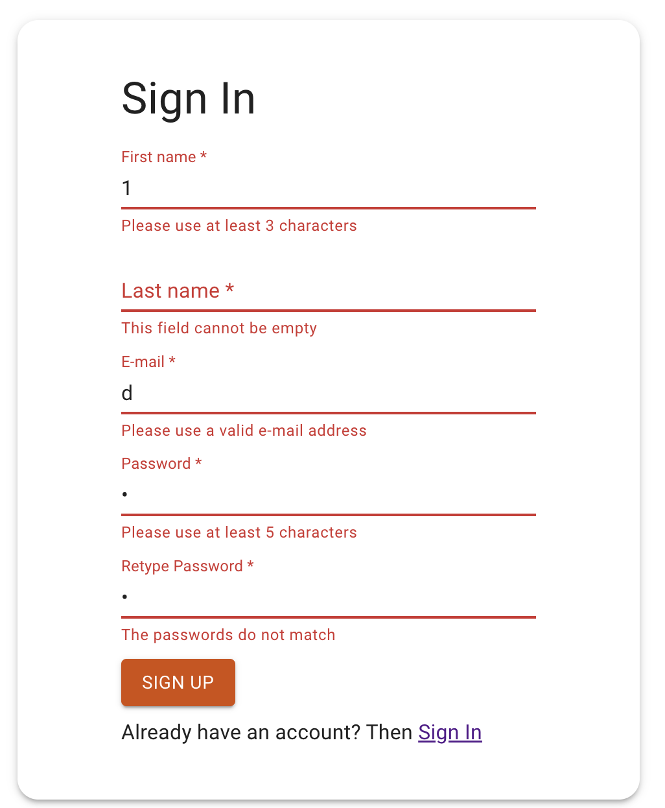
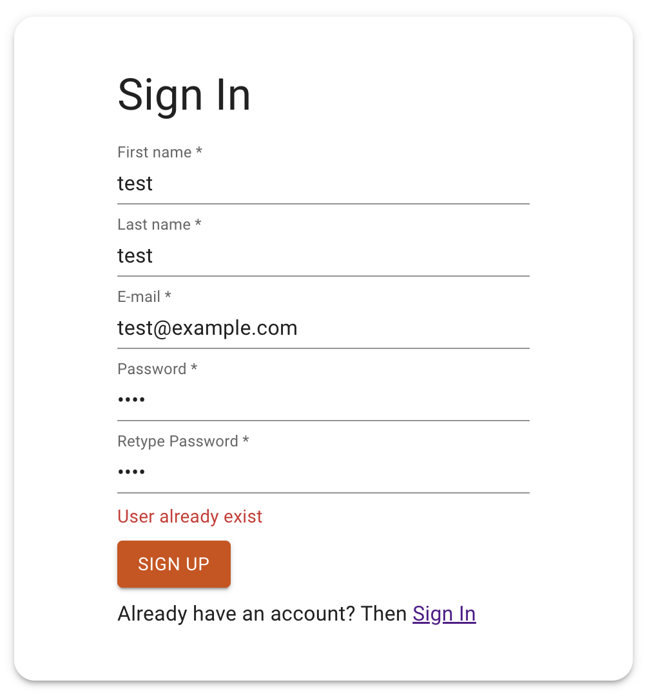

## Rejestracja
Stwórz branch na bazie gałęzi main:
`git checkout -b feature/signup main`

## Subtaski
- Stwórz nowy route `/signup`
- Tytuł strony w przeglądarce: `HR Dashboard - Sign Up`
- Dodaj przekierowanie na ten route za pomocą przycisku znajdującego się na stronie głównej z poprzedniego zadania
- Wyświetl kartę na środku ekranu
- W karcie znajduje się tytuł `h1` `Sign Up`
- Pod tytułem wyświetla się formularz z 5 polami:
    - firstName - minimum 3 znaki, maksimum 15
    - lastName - minimum 3 znaki, maksimum 15
    - e-mail - odpowiednia walidacja dla adresów e-mail
    - hasło -  minimum 5 znaków, maksimum 15
    - repeatPassword - to samo, dodatkowo sprawdzenie czy oba hasła są identyczne
- Każdy input wyświetla pod spodem błędy walidacji
- Na końcu formularza wyświetla się przycisk `SIGN UP`, który wysyła formularz
- Wysyłka formularza polega na wysłaniu odpowiedniego requestu w celu zarejestrowania użytkownika
`POST /auth/register`
Payload:
```
{
    "firstName": string,
    "lastName": string,
    "email": string,
    "password": string,
}
```
- Na samym dole karty wyświetla się tekst `Already have an account? Then Sign In`, gdzie `Sign In` to link przekierowujący na stronę logowania

## Nice to have
- Nie wysyłaj `passwordRepeat`, nie jest to wymagane przez backend
- Obsługa błędu z api za pomocą czerwonego alertu pod formularzem

## Szacunkowa estymacja: 6h

## Przykłady:
Empty state:

Walidacja:

Backend error:

