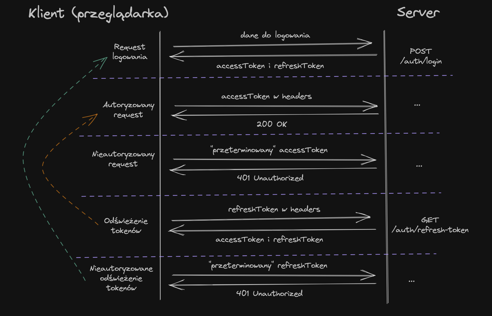
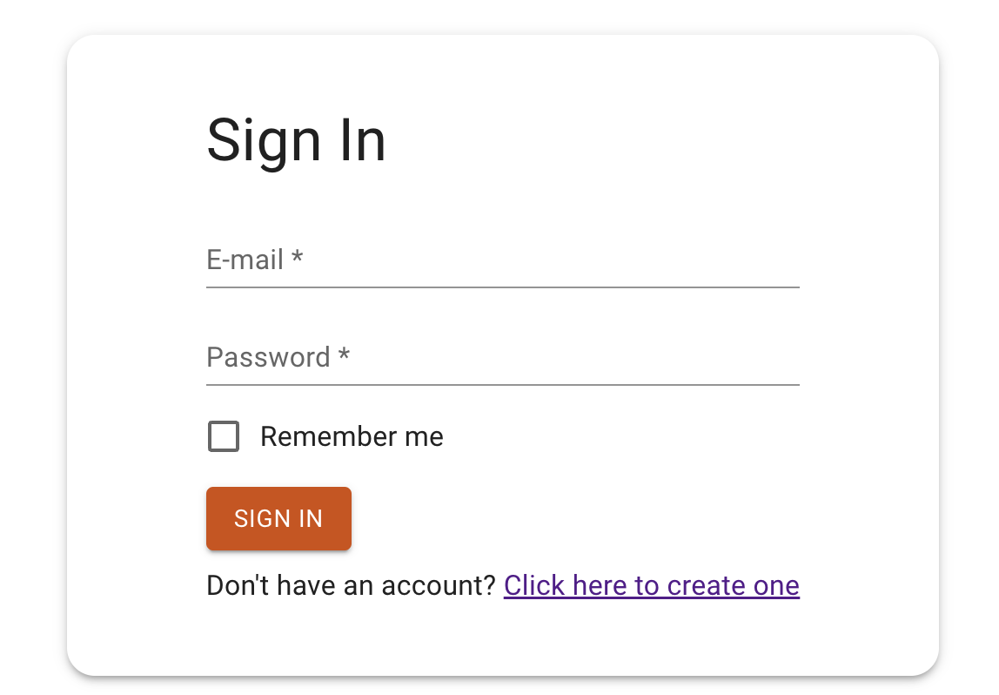

## Logowanie

Stwórz branch na bazie gałęzi main:
`git checkout -b feature/signin main`

UWAGA!
Opisany poniżej task wymaga obsługi rotacji tokenów.
Istnieje możliwość znacznego uproszczenia procesu autoryzacji pomijając logikę związaną z odświeżaniem tokenów.
W tym celu zaloguj się za pomocą endpointu `POST /auth/basic-login`, w odpowiedzi otrzymasz tylko `accessToken` który będzie ważny przez 3 dni.

## Subtaski

- Stwórz nowy route `/signin`
- Tytuł strony w przeglądarce: `HR Dashboard - Sign In`
- Dodaj przekierowanie na ten route za pomocą przycisku znajdującego się na stronie głównej z zadania 1
- Dodaj przekierowanie na ten route za pomocą linku z zadania 2
- Dodaj przekierowanie na ten route po poprawnej rejestracji
- Wyświetl kartę na środku ekranu
- W karcie znajduje się tytuł `h1` `Sign In`
- Pod tytułem wyświetla się formularz z 2 polami:
  - e-mail - odpowiednia walidacja dla adresów e-mail
  - hasło - minimum 5 znaków, maksimum 15
- Każdy input wyświetla pod spodem błędy walidacji
- Pod inputami wyświetla się checkbox `Remember me`
  - jeżeli formularz zostanie wysłany z zaznaczonym checkboxem należy zapamiętać w przeglądarce token użytkownika w taki sposób aby po odświeżeniu strony użytkownik nadal był zalogowany
  - jeżeli nie zostanie zaznaczony to po odświeżeniu strony użytkownik jest wylogowany
- Na końcu formularza wyświetla się przycisk `SIGN IN`, który wysyła formularz
- Wysyłka formularza polega na wysłaniu odpowiedniego requestu w celu zalogowania użytkownika
  `POST /auth/login`
  PAYLOAD:

```
{
    "email": string,
    "password": string
}
```

W odpowiedzi otrzymasz access token który będzie Ci potrzebny do autoryzacji przy kolejnych requestach do API.
W związku z tym powinieneś zapisać token tak aby mieć do niego dostęp z innych miejsc w kodzie. Można to osiągnąć np. za pomocą contextu.

- Na samym dole karty wyświetla się tekst `Don't have an account? Click here to create one`, gdzie `Click here to create one` to link przekierowujący na stronę rejestracji
- Access token jest ważny tylko przez 5 minut, po tym czasie endpointy zaczną zwracać status 401 Unauthorized.
  Aby kontynuować korzystanie z api powinieneś odświeżyć access token za pomocą refresh tokena, którego również otrzymasz w odpowiedzi na request dotyczący logowania. W celu odświeżenia access tokenu wyślij request `POST /auth/refresh-token`, body: `refreshToken: '<REFRESH_TOKEN>'`, w odpowiedzi otrzymasz nową parę tokenów, podmień tokeny w stanie aplikacji/local storage. Cały proces powinien być zautomatyzowany za pomocą licznika na długość ważności accessTokenu, który uruchomi request refreshujący tokeny. Możesz otrzymać ważność tokenu za pomocą wbudowanej w przeglądarki funkcji `atob:`
  ```tsx
    const tokenExpirationDate = JSON.parse(atob(token.split('.')[1])).exp * 1000;
  ```
  Powyższą zmienną możesz użyć w konstruktorze daty `new Date(tokenExpirationDate)` lub ustawić odpowiedni timeout dla odświeżenia pary tokenów.
  Możesz również zrobić research na temat innych sposobów na odświeżanie tokenów (np. axios interceptor) lecz moim zdaniem ten jest najprostszy.
- Refresh token jest ważny przez 3 dni jednak przy każdym logowaniu/odświeżeniu generuje się nowy i tylko ten najnowszy refresh token jest prawidłowy. Próba użycia poprzedniego refresh tokena zakończy się statusem 401 Unauthorized mimo to, że token jest nadal ważny.

Diagram ukazujący flow autoryzacji:


## Nice to have

- Obsługa błędu z api za pomocą czerwonego alertu pod formularzem
- Dodaj timer sesji `Sesja 04:59`...`Sesja 04:58` oraz przycisk do przedłużania sesji. Przycisk wysyła request refreshujący tokeny oraz resetuje timer sesji.

## Szacunkowa estymacja: 10h


## Przykłady:


