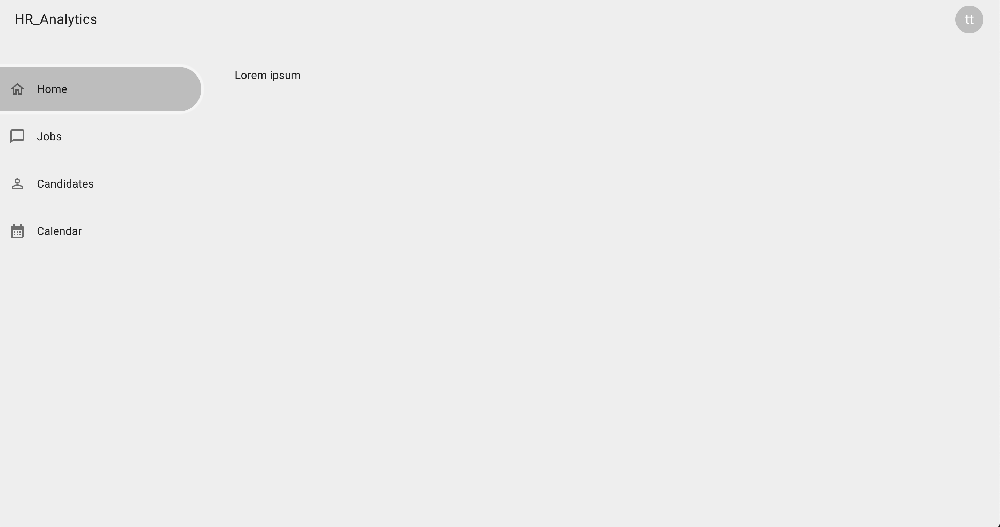
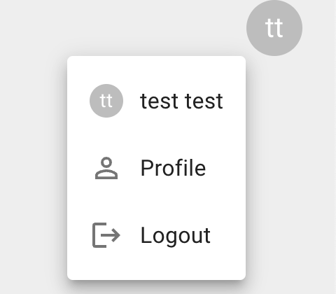

## Dashboard layout

Stwórz branch na bazie gałęzi main:
`git checkout -b feature/dashboard-layout main`

## Subtaski

- Stwórz nowy route `/dashboard`
- Tytuł strony w przeglądarce: `HR Dashboard - Dashboard`
- Dodaj przekierowanie na ten route po zalogowaniu
- Na górze dashboardu wyświetla się pasek, który po lewej stronie wyświetla HR_Analytics a po prawej stronie avatar z inicjałami użytkownika
  - dane o obecnie zalogowanym użytkowniku uzyskasz wysyłając request `GET /users/me`
  - inicjały powinny być zawsze z małej litery np. "John Doe"->"jd"
  - avatar pokazuje menu po kliknięciu na niego menu, które zawiera 3 elementy:
    - nazwę użytkownika z mniejszą wersją avatara, ten element menu nic nie będzie robić, jest tylko prezentacyjny
    - Profile (później będzie to link do strony profile)
    - Logout, który po kliknięciu wyloguje użytkownika oraz przekieruje na stronę główną
  - jeżeli menu avatara jest rozwinięte to kliknięcie poza menu powoduje jego zamknięcie
- Po lewej stronie dashboardu wyświetla się sidebar, który zawiera 3 elementy:
  - Home, ten element przekierowuje na /dashboard
  - Jobs (później będzie to link do strony z ofertami pracy)
  - Candidates (później będzie to link do strony z listą kandydatów)
- Na tym etapie content w środku layout możesz zastąpić jakimś place holderem typu lorem ipsum, prawdziwy content będzie dodany w kolejnym zadaniu
- Dashboard powinien być dostępny tylko dla zalogowanych użytkowników w tym celu wyślij request:
  `GET /users/me`, jeżeli otrzymasz response o statusie 200 to znaczy, że jesteś zalogowany, jeżeli inny to znaczy, że nie jesteś zalogowany.
  Do requestu powinien być dołączony Bearer token.
  Jeżeli użytkownik nie jest zalogowany to przekieruj go na stronę logowania.

## Nice to have
- Wersja mobilna która zamiast sidebara używa menu uruchamianego poprzez "burger menu"
- Jeżeli zalogowany użytkownik wejdzie na jedną ze stron: homepage, signup, signin to zostaje przekierowany na dashboard
- Aktywny link w sidebarze powinien się jakoś odznaczać na tle innych

## Szacunkowa estymacja: 6h

## Przykłady:

