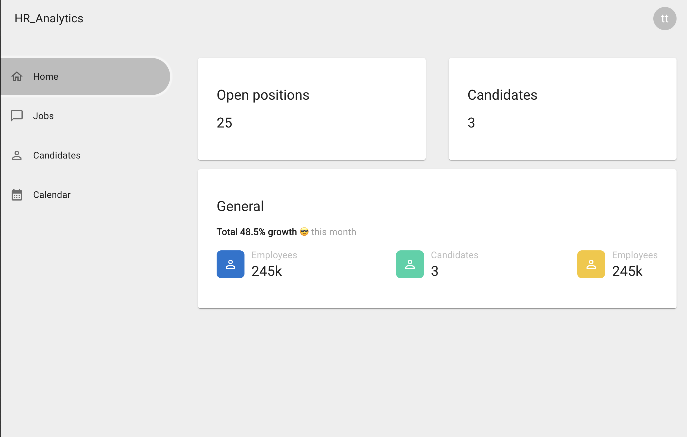

## Dashboard home
Stwórz branch na bazie gałęzi main:
`git checkout -b feature/dashboard-home main`

## Subtaski
- Do stworzonego wcześniej routa `/dashboard` dodaj content w postaci kilku kart
- Karta `Open positions` wyświetla ilość ofert pracy, oferty pracy pobierzesz z endpointu `GET /jobs`
- Karta `Candidates` wyświetla ilość kandydatów, kandydatów pobierzesz z endpointu `GET /candidates`
- Karta `General` wyświetla:
  - Total 48.5% growth 😎 this month (jest to zahardkodowane w kodzie)
  - Ponownie ilość kandydatów
  - Employees 245k (też zahardkodowane)

## Nice to have
- Wersja mobile powinna pokazywać wszystkie karty na pełną szerokość jedna pod drugą
- Animacja na liczbach polegająca na tym, że dana liczba zwiększa się od 0 do danej wartości
- obsługa błędów z api

## Szacunkowa estymacja: 4h

## Przykłady:

