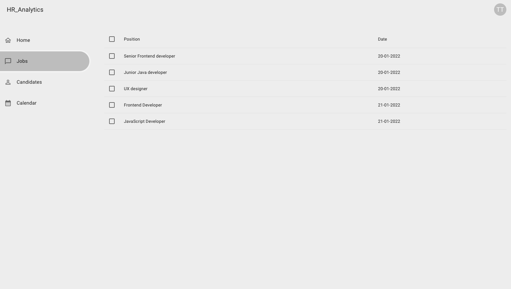
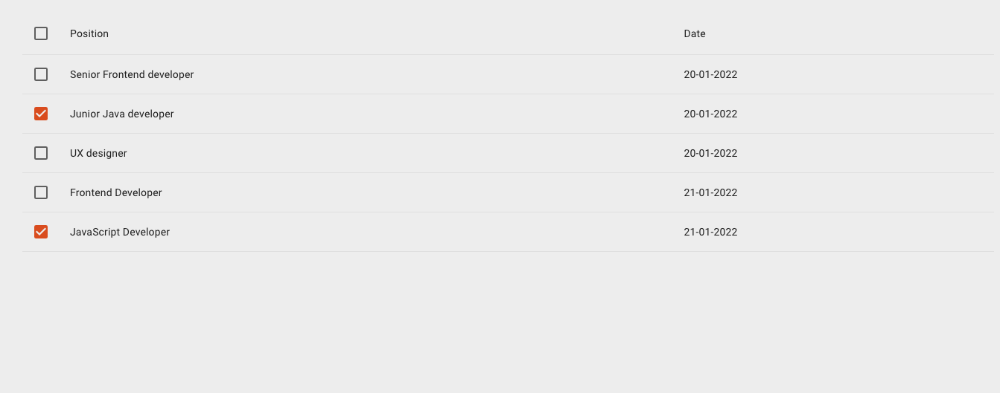
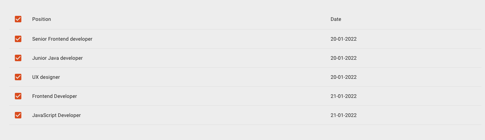

## Readonly jobs
Stwórz branch na bazie gałęzi main:
`git checkout -b feature/readonly-jobs main`

## Subtaski
- Stwórz nowy route `/jobs` 
- Tytuł strony w przeglądarce: `HR Dashboard - Jobs`
- Dodaj przekierowanie na ten route za pomocą elementu nawigacji w sidebarze
- Potrzebne dane otrzymasz wysyłając request `GET /jobs`
- Wyświetl tabelkę z następującymi kolumnami: 
  - `Position` - użyj pola `title` z response
  - `Date` - użyj pola `date` z response
- Dodaj pierwszą kolumnę w której wyświetlisz checkbox, checkbox w nagłówku zaznacza wszystkie rzędy tabelki na raz
- Pokaż tylko otwarte oferty pracy (przefiltruj po polu status)

## Nice to have
- Lokalna paginacja tabelki (wykonywana na frontendzie)
- Obsłuż stan braku danych (jeżeli backend zwróci pustą listę ofert pracy) wyświetlając tekst "Brak danych" zamiast tabelki
- Obsłuż błąd z api

## Szacunkowa estymacja: 6h

## Przykłady:

