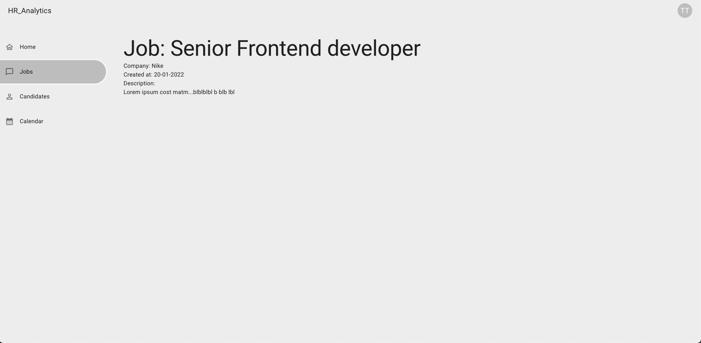
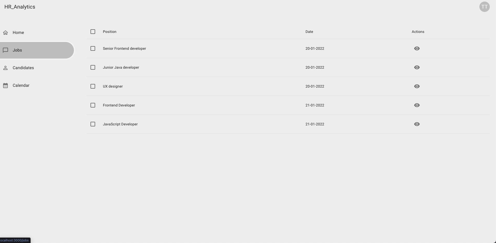

## Single job 
Stwórz branch na bazie gałęzi main:
`git checkout -b feature/single-job main`

## Subtaski
- Dodaj nowy route `/jobs/:id`
- Tytuł strony w przeglądarce: `HR Dashboard - <Nazwa oferty pracy>`, np.:/ `HR Dashboard - Senior Frontend Developer`
- Pobierz dane oferty wysyłając request `GET jobs/:id`, id możesz pobrać z adresu url przeglądarki
- Wyświetl nagłówek w formie `Job: ${nazwa_oferty_pracy}`, np.: `Job: Senior Frontend Developer`
- Wyświetl informację na temat danej oferty pracy: nazwa firmy, data utworzenia oferty oraz opis
- Obsłuż sytuację, gdy ktoś wpiszę złe id w adresie url, wyświetl informację o tym, że nie znaleziono takiej oferty pracy
- Do tabelki z ofertami pracy dodaj 3 kolumnę `actions`
- Wyświetl w tej kolumnie ikonę oka, która będzie linkiem, który przekierowuje na stronę tej oferty
- Dodaj informację o tym czy dana oferta jest otwarta czy zamknięta (pole status)

## Nice to have
- Obsłuż błąd z api

## Szacunkowa estymacja: 4h

## Przykłady:

