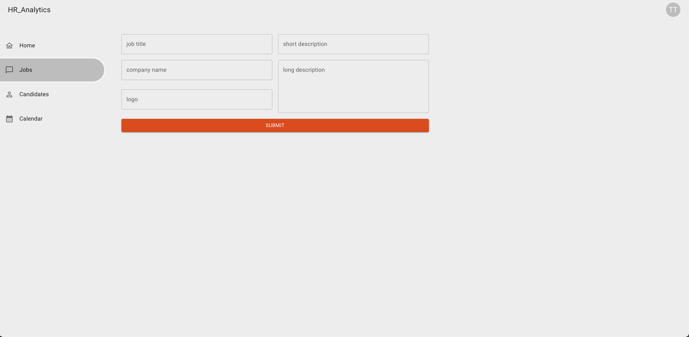
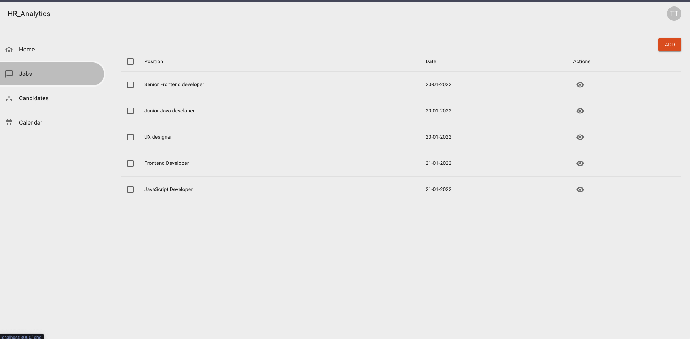
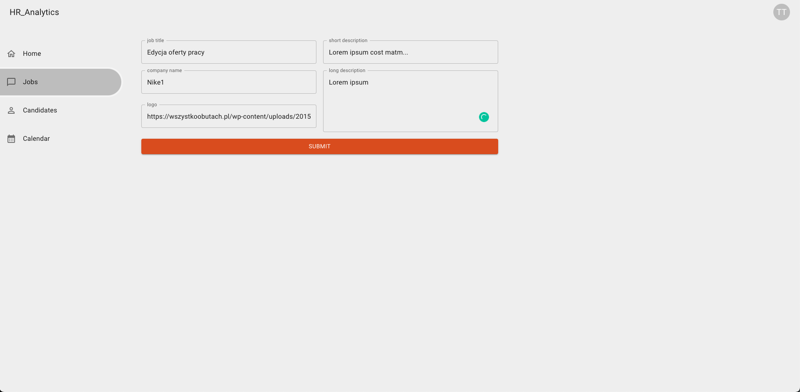
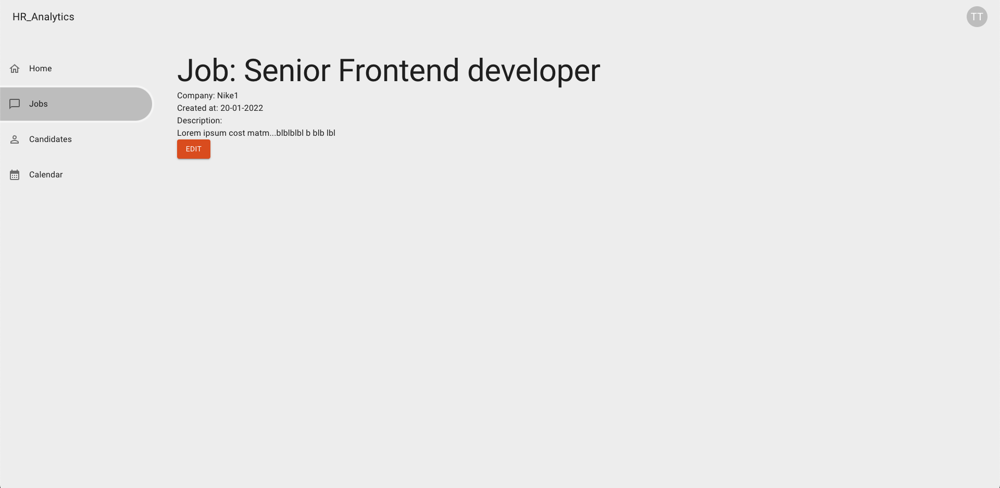

## Add/edit job
Stwórz branch na bazie gałęzi main:
`git checkout -b feature/add-edit-job main`

## Subtaski
- Dodaj nowy route `/jobs/add`
- Tytuł strony w przeglądarce: `HR Dashboard - Add Job`
- Nad tabelką z ofertami pracy dodaj przycisk, który jest linkiem przekierowującym na nowy route
- Wyświetl formularz dodawania oferty pracy:
  ```
  companyName: string
  logo: string
  longDescription: string
  shortDescription: string
  title: string
  ```
- Każde pole wymaga minimum 5 znaków z wyjątkiem title, które wymaga minimum 3 znaków
- Pole longDescription jest `textarea`, maksymalna długość znaków to 100
- Wyświetl licznik znaków pod `longDescription`, np. `50/100`, gdy użytkownik przekroczy 100 znaków to licznik powinien zmienić kolor na czerwony bez żadnego dodatkowego komunikatu błędu
- Użytkownik może przekroczyć 100 znaków, więc stan `110/100` jest jak najbardziej osiągalny. Formularz jednak nie powinien umożliwić wysłania takiej wartości do backendu.
- Wyświetl przycisk `Submit` który wysyla formularz za pomocą requestu `POST /jobs`
- Po udanym dodaniu oferty pracy przekieruj użytkownika na stronę z tabelką ofert pracy
- Dodaj nowy route `jobs/:id/edit`
- Tytuł strony w przeglądarce: `HR Dashboard - Edit Job`
- Na stronie pojedynczej oferty pracy dodaj przycisk `Edit`, który jest linkiem przekierowującym na nowy route
- Użyj tego samego komponentu co przy dodawaniu nowej oferty pracy, ale wykorzystaj dane edytowanej oferty pracy aby wstępnie wypełnić pola formularza (skorzystaj z requestu do pobierania pojedynczej oferty pracy z poprzedniego zadania)
- Przycisk `Submit` wysyła formularz za pomocą requestu `PATCH /jobs/:id`

## Nice to have
- Obsłuż błąd z api wyświetlając odpowiedni komunikat
- Edytując ofertę pracy wysyłaj tylko te wartości które rzeczywiście się zmieniły
- Jeżeli dany job ma status `CLOSED` to formularz edycji jest read-only

# Szacunkowa estymacja: 8h

## Przykłady:





